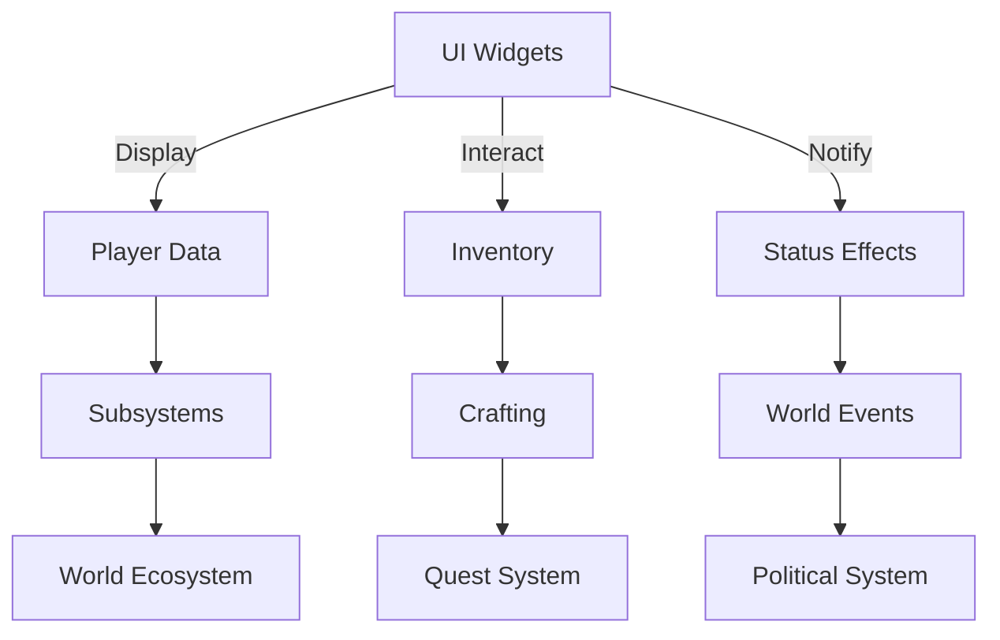

<div align="center">
  <h1>📚 Dark Age API Documentation</h1>
  
  <h3>API Index & System Relationships</h3>
  <p style="font-size:1.1em;">API and usage documentation for all major public classes, components, and subsystems in the project.</p>
</div>

---



---

<!-- Visual Example Placeholder -->


# Dark Age API Documentation Index

This directory contains API and usage documentation for all major public classes, components, and subsystems in the project. Each file provides an overview, usage examples, and integration notes for the corresponding code module.

## Structure
- One markdown file per major class, component, or subsystem (named after the header file/class)
- Each file includes: Purpose, Key Methods/Properties, Example Usage, Integration Points

## Coverage
- UI Widgets (e.g., ADAHUD, UDAInventoryWidget, UDAPlayerStatusWidget, etc.)
- Core Subsystems (e.g., WorldEcosystemSubsystem, CrimeManagerSubsystem, FactionManagerSubsystem, QuestSystem, etc.)
- Components (e.g., StatlineComponent, InventoryComponent, CraftingComponent, NotorietyComponent, etc.)
- Data Structures (e.g., WorldEcosystemData, PlayerSkillData, etc.)
- Systems (e.g., DiseaseSystem, PoliticalSystem, etc.)

> If you find a class or system without a corresponding API doc, please add a new markdown file in this directory following the template below.

## API Doc Template
```
# [ClassName] ([HeaderFile.h])

## Purpose
Brief description of what this class/component/subsystem does.

## Key Methods & Properties
- List and describe the most important methods and properties.

## Example Usage
Provide a code snippet or usage scenario.

## Integration Points
Describe how this class interacts with other systems/components.

## Best Practices
- List best practices for using/extending this class.

## Common Pitfalls
- List common mistakes or issues and how to avoid them.

## How-To Guides
- Step-by-step guides for common tasks (e.g., adding a new quest, extending the UI).

## Visuals


## Notes
Any special considerations, limitations, or extension points.
```
