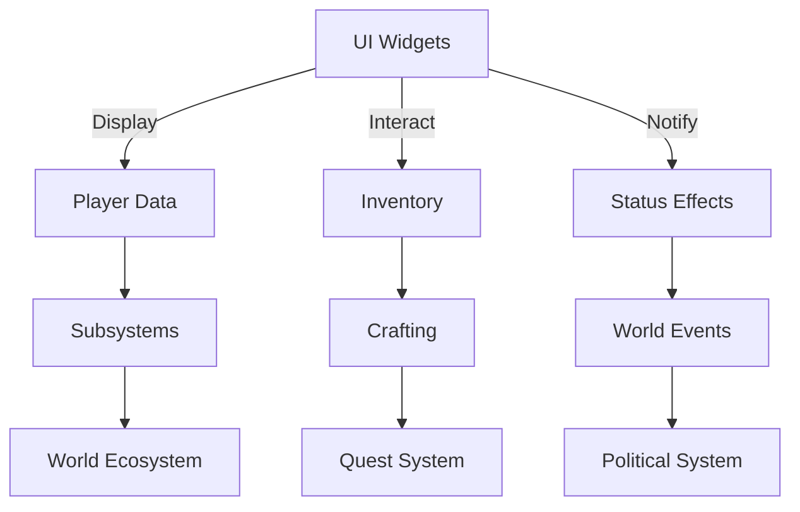

# 📚 Dark Age API Documentation Index

This page provides an overview and entry point for all API documentation in Dark Age.

---

---

## API Modules
- UI Widgets (e.g., ADAHUD, UDAInventoryWidget, UDAPlayerStatusWidget)
- Core Subsystems (e.g., WorldEcosystemSubsystem, CrimeManagerSubsystem, FactionManagerSubsystem, QuestSystem)
- Components (e.g., StatlineComponent, InventoryComponent, CraftingComponent, NotorietyComponent)

Each module has its own page with purpose, key methods/properties, usage, and integration notes.

For the full list, see the [docs/api](../docs/api/) directory.
